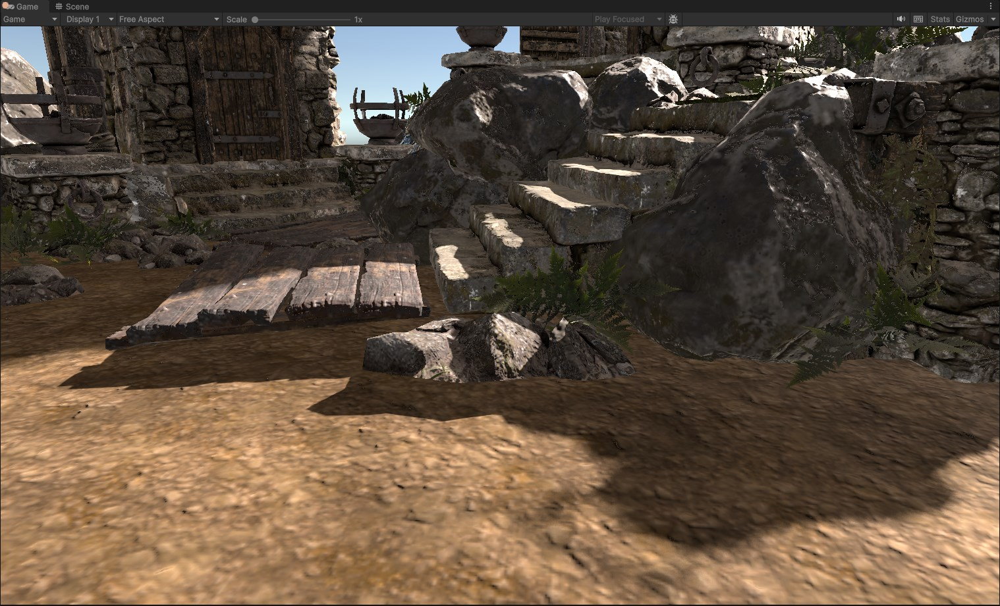
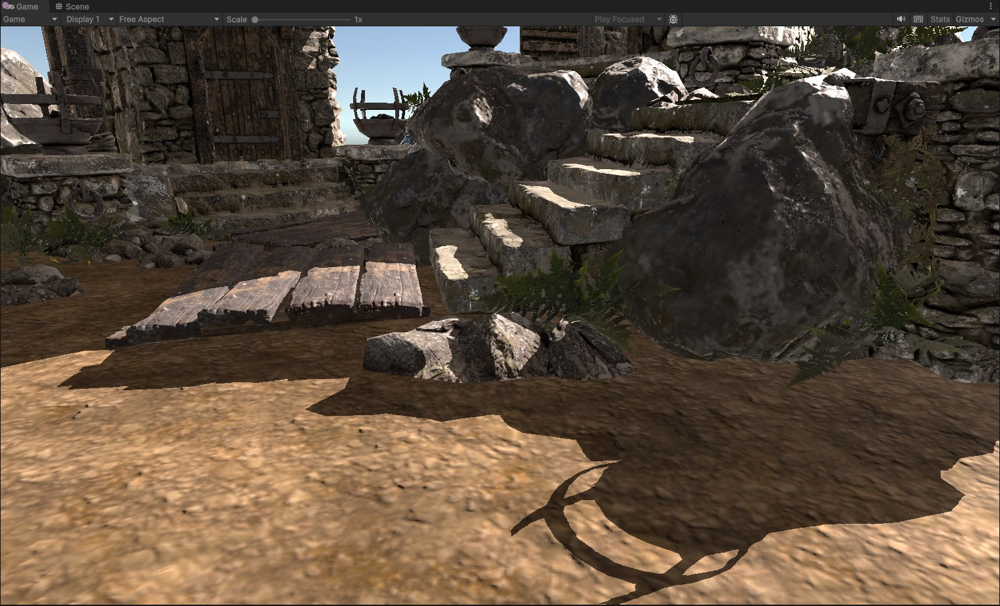
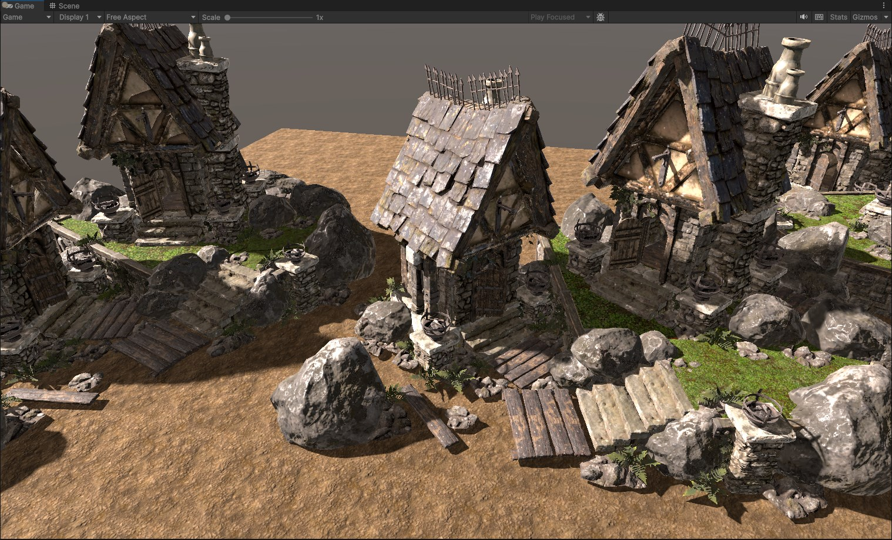

# Inline Ray Tracing Shadows
Sample scene that uses ray traced shadows generated by a compute shader using ray queries. 

# Effect Description
The  [compute shader](Assets/RayTracingShadows/ComputeShaderRayQuery.compute) reads the depth value from [_CameraDepthTexture](https://docs.unity3d.com/Manual/SL-CameraDepthTexture.html) built-in texture. The world space position for a particular pixel is generated and from that point a number of rays are cast along the light direction with some random offsets for generating variable penumbra based on the distance from the shadow caster.

The world normal is read from the GBuffer _CameraGBufferTexture2 and is used to avoid generating shadows for surfaces that have the same orientation as the directional light.

There is a simple temporal accumulation of samples which resets when parameters related to camera change.

Limitations:
- the rendering path must be set to Deferred in Camera settings.
- the shadow is currently generated on top of everything else so the regular shadows must be disabled from the Light settings.
- the effect works only in Game view.

